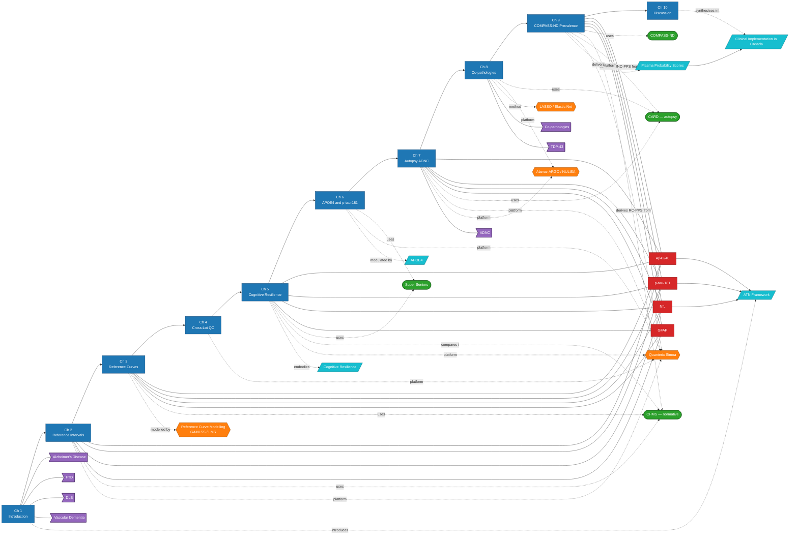

# Brain Map

A Mermaid-rendered "brain map" of the thesis. View this in [Obsidian](https://obsidian.md), GitHub (which renders Mermaid natively), or any Markdown viewer with Mermaid support.

For an interactive force-directed version, open [`vault-graph.html`](../../vault-graph.html) at the repo root in a browser.

## Whole-thesis graph

## Reading the map

- **Blue rectangles** = chapters (the spine, left to right)
- **Red rectangles** = the four canonical plasma biomarkers
- **Green ovals** = cohorts
- **Orange hexagons** = methods / platforms
- **Purple flags** = diseases / pathologies
- **Teal parallelograms** = unifying concepts

The chapter flow runs C1 → C10 across the top; everything else attaches to chapters.

## Smaller views

If the full graph is too dense, see:

- [[Map - Chapters and Cohorts]]
- [[Map - Biomarkers and Pathology]]

## Per-chapter detailed maps

One Mermaid map per chapter showing sub-section structure, methods, key findings, and forward links:

- [[Chapter 01 - Map]] — Introduction (12 sub-sections, biomarker/method anchors)
- [[Chapter 02 - Map]] — Reference Intervals (U-shaped curves, cross-lot agreement)
- [[Chapter 03 - Map]] — Reference Curves (GAMLSS/LMS, web app, sex-modified p-tau-181)
- [[Chapter 04 - Map]] — Cross-Lot QC (within/between-lot bias, harmonisation)
- [[Chapter 05 - Map]] — Cognitive Resilience (38% biomarker-super, female enrichment)
- [[Chapter 06 - Map]] — APOE4 × p-tau-181 (published)
- [[Chapter 07 - Map]] — Autopsy ADNC (AUROCs 0.84/0.88/0.91, Thal/Braak/CERAD/ABC)
- [[Chapter 08 - Map]] — Co-pathologies (LASSO α=1, elastic-net α=0.5, NULISA 120-plex)
- [[Chapter 09 - Map]] — COMPASS-ND Prevalence (RC-PPS + ADNC-PPS pipeline)
- [[Chapter 10 - Map]] — Discussion (Canadian implementation pull-throughs)
