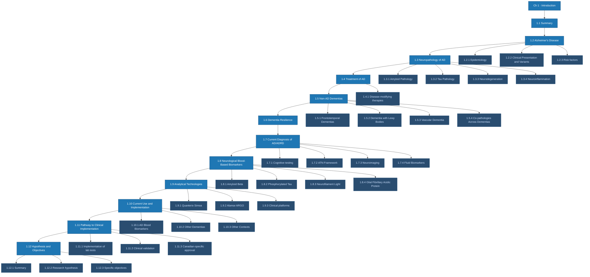
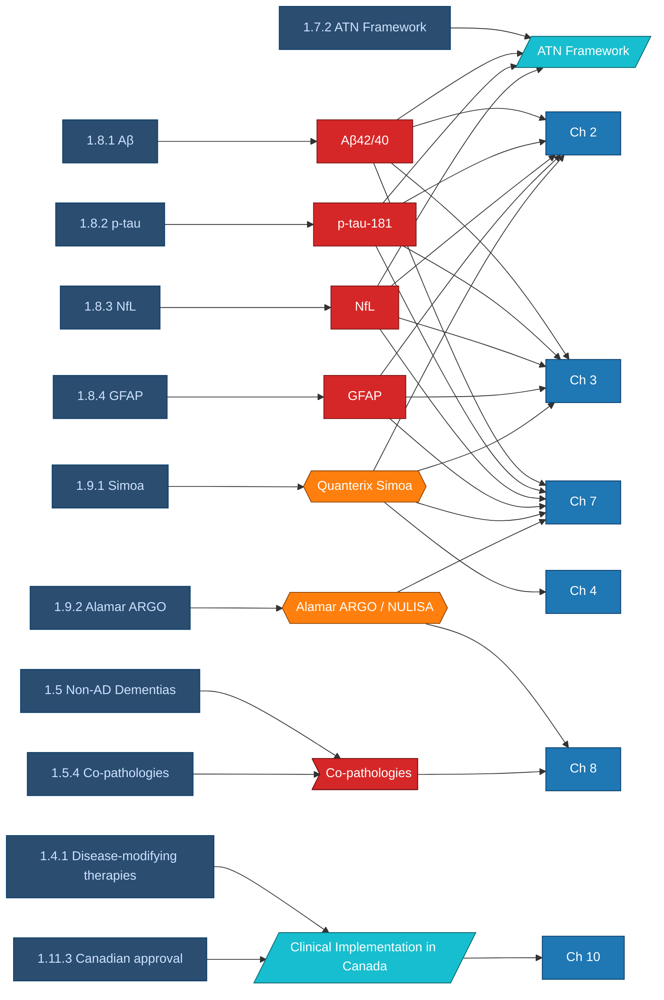

# Chapter 1 — Detailed Map

The chapter's full sub-section structure with cross-references into other chapters and the canonical entity notes.

## Section structure

## Concepts introduced in Ch 1 and where they're operationalised

## Reading list — concept notes referenced

- Diseases: [[Alzheimer's Disease]] · [[Frontotemporal Dementia]] · [[Dementia with Lewy Bodies]] · [[Vascular Dementia]] · [[Cerebral Amyloid Angiopathy]] · [[neuroinflammation]]
- Pathology: [[ADNC]] · [[Co-pathologies]] · [[TDP-43 Pathology]]
- Biomarkers: [[Aβ42-40]] · [[p-tau-181]] · [[NfL]] · [[GFAP]]
- Methods: [[Quanterix Simoa]] · [[Alamar ARGO]] · [[NULISA]]
- Concepts: [[ATN Framework]] · [[NIA-AA]] · [[Cognitive Resilience]] · [[Clinical Implementation in Canada]] · [[CADTH]]

## Forward links

| §     | Concept introduced                | Used in chapter(s) |
|-------|-----------------------------------|--------------------|
| 1.7.2 | [[ATN Framework]]                 | implicit throughout 2–9 |
| 1.8   | The four canonical biomarkers     | 2, 3, 4, 5, 6, 7, 9 |
| 1.9.1 | [[Quanterix Simoa]]               | 2, 3, 4, 5, 6, 7, 9 |
| 1.9.2 | [[Alamar ARGO]] / [[NULISA]]      | 7, 8 |
| 1.5.4 | [[Co-pathologies]]                | 8 |
| 1.6   | [[Cognitive Resilience]]          | 5, 6 |
| 1.11  | [[Clinical Implementation in Canada]] | 9, 10 |
