# Chapter 2 — Detailed Map

```mermaid
graph TD
    classDef sec  fill:#1f77b4,stroke:#0b3d69,color:#fff;
    classDef sub  fill:#2a4d70,stroke:#0b3d69,color:#cfe2ff;
    classDef ent  fill:#d62728,stroke:#7a1414,color:#fff;
    classDef coh  fill:#2ca02c,stroke:#0f4f0f,color:#fff;
    classDef meth fill:#ff7f0e,stroke:#8a4304,color:#fff;
    classDef find fill:#17becf,stroke:#0a6770,color:#fff;
    classDef tab  fill:#666,stroke:#333,color:#fff;

    C2[Ch 2 · Reference Intervals]:::sec
    S21[2.1 Introduction]:::sec
    S22[2.2 Methods]:::sec
    S23[2.3 Results]:::sec
    S24[2.4 Discussion]:::sec
    S25[2.5 Conclusion]:::sec
    C2 --> S21 --> S22 --> S23 --> S24 --> S25

    %% methods sub
    S221[2.2.1 Ethics]:::sub
    S222[2.2.2 Participant / specimen]:::sub
    S223[2.2.3 Biomarker analysis]:::sub
    S224[2.2.4 Cross lot analysis]:::sub
    S225[2.2.5 Statistical analysis]:::sub
    S22 --> S221 & S222 & S223 & S224 & S225

    %% results sub
    S231[2.3.1 Reference Intervals]:::sub
    S232[2.3.2 Assay Lot Agreement]:::sub
    S23 --> S231 & S232

    %% discussion sub
    S241[2.4.1 Interpretation of RIs]:::sub
    S242[2.4.2 Current and Future Utilities]:::sub
    S243[2.4.3 Generalizability]:::sub
    S244[2.4.4 Limitations]:::sub
    S24 --> S241 & S242 & S243 & S244

    %% inputs / outputs
    CHMS([CHMS · ages 3–79]):::coh
    SIM{{Quanterix Simoa N4PE + p-tau-181 V2}}:::meth
    AB[Aβ42/40]:::ent
    PT[p-tau-181]:::ent
    NF[NfL]:::ent
    GF[GFAP]:::ent
    T21[Table 2.1 · discrete RIs]:::tab
    T22[Table 2.2 · cross-lot N4PE/p-tau-181]:::tab

    F1[Finding · U-shaped curves<br/>across age 3–79]:::find
    F2[Finding · sex not a modifier]:::find
    F3[Finding · ≥1 age partition<br/>per biomarker]:::find
    F4["Finding · cross-lot agreement<br/>within ~4 pg/mL under 60y"]:::find

    S222 --> CHMS
    S223 --> SIM
    SIM --> AB & PT & NF & GF
    S231 --> T21
    S232 --> T22
    S231 --> F1 & F2 & F3
    S232 --> F4

    %% downstream
    NEXT[→ Ch 3 continuous curves]:::sec
    NEXT2[→ Ch 4 expanded QC]:::sec
    NEXT3[→ Ch 5 / Ch 9 use these norms]:::sec
    F1 --> NEXT
    F4 --> NEXT2
    T21 --> NEXT3
```

## Publication

Cooper JG, Stukas S, Ghodsi M, Ahmed N, Diaz-Arrastia R, Holmes DT, Wellington CL.
*Age-specific reference intervals for plasma biomarkers of neurodegeneration and neurotrauma in a Canadian population.* Clin Biochem 2023;121:110680.

See also: [[Chapter 02 - Reference Intervals]] · [[Brain Map]] · [[CHMS]]
