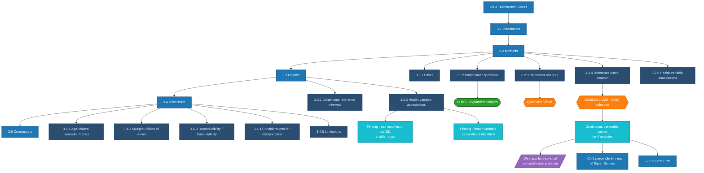

# Chapter 3 — Detailed Map

```mermaid
graph TD
    classDef sec  fill:#1f77b4,stroke:#0b3d69,color:#fff;
    classDef sub  fill:#2a4d70,stroke:#0b3d69,color:#cfe2ff;
    classDef ent  fill:#d62728,stroke:#7a1414,color:#fff;
    classDef coh  fill:#2ca02c,stroke:#0f4f0f,color:#fff;
    classDef meth fill:#ff7f0e,stroke:#8a4304,color:#fff;
    classDef find fill:#17becf,stroke:#0a6770,color:#fff;
    classDef app  fill:#9467bd,stroke:#4b2c66,color:#fff;

    C3[Ch 3 · Reference Curves]:::sec
    S31[3.1 Introduction]:::sec
    S32[3.2 Methods]:::sec
    S33[3.3 Results]:::sec
    S34[3.4 Discussion]:::sec
    S35[3.5 Conclusions]:::sec
    C3 --> S31 --> S32 --> S33 --> S34 --> S35

    S321[3.2.1 Ethics]:::sub
    S322[3.2.2 Participant / specimen]:::sub
    S323[3.2.3 Biomarker analysis]:::sub
    S324[3.2.4 Reference curve creation]:::sub
    S325[3.2.5 Health-variable associations]:::sub
    S32 --> S321 & S322 & S323 & S324 & S325

    S331[3.3.1 Continuous reference intervals]:::sub
    S332[3.3.2 Health-variable associations]:::sub
    S33 --> S331 & S332

    S341[3.4.1 Age-related biomarker trends]:::sub
    S342[3.4.2 Multiple utilities of curves]:::sub
    S343[3.4.3 Reproducibility / translatability]:::sub
    S344[3.4.4 Considerations for interpretation]:::sub
    S345[3.4.5 Limitations]:::sub
    S34 --> S341 & S342 & S343 & S344 & S345

    CHMS([CHMS · expanded analysis]):::coh
    SIM{{Quanterix Simoa}}:::meth
    GAMLSS{{GAMLSS / LMS · GAIC selection}}:::meth
    APP[/Web app for individual<br/>percentile interpretation/]:::app
    CURVES[Continuous percentile curves<br/>for 4 analytes]:::find

    F1[Finding · sex modifies p-tau-181<br/>at older ages]:::find
    F2[Finding · health-variable<br/>associations identified]:::find

    S322 --> CHMS
    S323 --> SIM
    S324 --> GAMLSS --> CURVES
    S332 --> F1 & F2
    CURVES --> APP

    NEXT1[→ Ch 5 percentile binning<br/>of Super Seniors]:::sec
    NEXT2[→ Ch 9 RC-PPS]:::sec
    CURVES --> NEXT1 & NEXT2
```

See also: [[Chapter 03 - Reference Curves]] · [[Reference Curve Modelling]] · [[GAMLSS]] · [[LMS]]
