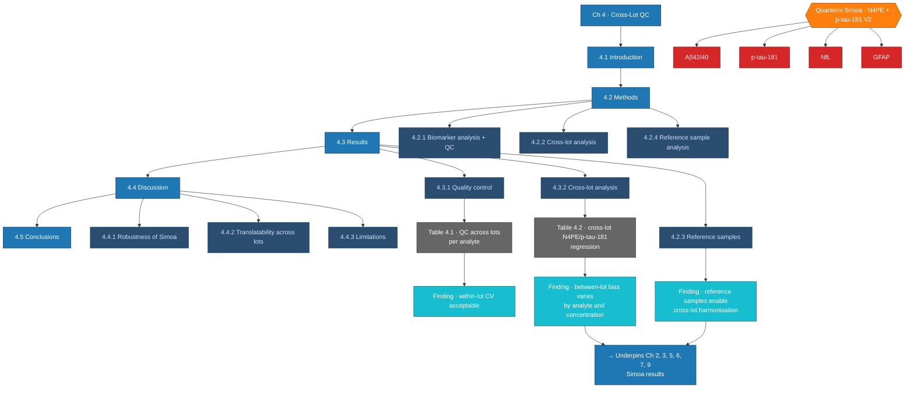

# Chapter 4 — Detailed Map

```mermaid
graph TD
    classDef sec  fill:#1f77b4,stroke:#0b3d69,color:#fff;
    classDef sub  fill:#2a4d70,stroke:#0b3d69,color:#cfe2ff;
    classDef ent  fill:#d62728,stroke:#7a1414,color:#fff;
    classDef meth fill:#ff7f0e,stroke:#8a4304,color:#fff;
    classDef find fill:#17becf,stroke:#0a6770,color:#fff;
    classDef tab  fill:#666,stroke:#333,color:#fff;

    C4[Ch 4 · Cross-Lot QC]:::sec
    S41[4.1 Introduction]:::sec
    S42[4.2 Methods]:::sec
    S43[4.3 Results]:::sec
    S44[4.4 Discussion]:::sec
    S45[4.5 Conclusions]:::sec
    C4 --> S41 --> S42 --> S43 --> S44 --> S45

    S421[4.2.1 Biomarker analysis + QC]:::sub
    S422[4.2.2 Cross-lot analysis]:::sub
    S424[4.2.4 Reference sample analysis]:::sub
    S42 --> S421 & S422 & S424

    S431[4.3.1 Quality control]:::sub
    S432[4.3.2 Cross-lot analysis]:::sub
    S433[4.2.3 Reference samples]:::sub
    S43 --> S431 & S432 & S433

    S441[4.4.1 Robustness of Simoa]:::sub
    S442[4.4.2 Translatability across lots]:::sub
    S443[4.4.3 Limitations]:::sub
    S44 --> S441 & S442 & S443

    SIM{{Quanterix Simoa · N4PE + p-tau-181 V2}}:::meth
    AB[Aβ42/40]:::ent
    PT[p-tau-181]:::ent
    NF[NfL]:::ent
    GF[GFAP]:::ent

    T41[Table 4.1 · QC across lots<br/>per analyte]:::tab
    T42[Table 4.2 · cross-lot N4PE/p-tau-181<br/>regression]:::tab

    F1[Finding · within-lot CV acceptable]:::find
    F2[Finding · between-lot bias varies<br/>by analyte and concentration]:::find
    F3[Finding · reference samples enable<br/>cross-lot harmonisation]:::find

    SIM --> AB & PT & NF & GF
    S431 --> T41 --> F1
    S432 --> T42 --> F2
    S433 --> F3

    USE[→ Underpins Ch 2, 3, 5, 6, 7, 9<br/>Simoa results]:::sec
    F2 --> USE
    F3 --> USE
```

See also: [[Chapter 04 - Cross Lot Analysis]] · [[Quanterix Simoa]]
