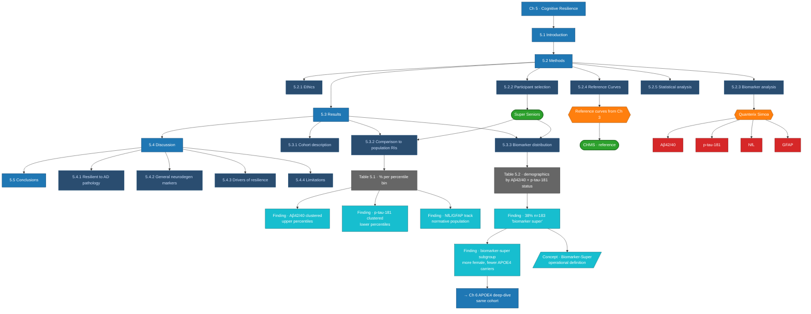

# Chapter 5 — Detailed Map

```mermaid
graph TD
    classDef sec  fill:#1f77b4,stroke:#0b3d69,color:#fff;
    classDef sub  fill:#2a4d70,stroke:#0b3d69,color:#cfe2ff;
    classDef ent  fill:#d62728,stroke:#7a1414,color:#fff;
    classDef coh  fill:#2ca02c,stroke:#0f4f0f,color:#fff;
    classDef meth fill:#ff7f0e,stroke:#8a4304,color:#fff;
    classDef find fill:#17becf,stroke:#0a6770,color:#fff;
    classDef tab  fill:#666,stroke:#333,color:#fff;
    classDef con  fill:#17becf,stroke:#0a6770,color:#fff;

    C5[Ch 5 · Cognitive Resilience]:::sec
    S51[5.1 Introduction]:::sec
    S52[5.2 Methods]:::sec
    S53[5.3 Results]:::sec
    S54[5.4 Discussion]:::sec
    S55[5.5 Conclusions]:::sec
    C5 --> S51 --> S52 --> S53 --> S54 --> S55

    S521[5.2.1 Ethics]:::sub
    S522[5.2.2 Participant selection]:::sub
    S523[5.2.3 Biomarker analysis]:::sub
    S524[5.2.4 Reference Curves]:::sub
    S525[5.2.5 Statistical analysis]:::sub
    S52 --> S521 & S522 & S523 & S524 & S525

    S531[5.3.1 Cohort description]:::sub
    S532[5.3.2 Comparison to population RIs]:::sub
    S533[5.3.3 Biomarker distribution]:::sub
    S53 --> S531 & S532 & S533

    S541[5.4.1 Resilient to AD pathology]:::sub
    S542[5.4.2 General neurodegen markers]:::sub
    S543[5.4.3 Drivers of resilience]:::sub
    S544[5.4.4 Limitations]:::sub
    S54 --> S541 & S542 & S543 & S544

    SS([Super Seniors]):::coh
    CHMS([CHMS · reference]):::coh
    SIM{{Quanterix Simoa}}:::meth
    RC{{Reference curves from Ch 3}}:::meth

    AB[Aβ42/40]:::ent
    PT[p-tau-181]:::ent
    NF[NfL]:::ent
    GF[GFAP]:::ent

    T51[Table 5.1 · % per percentile bin]:::tab
    T52[Table 5.2 · demographics by Aβ42/40 + p-tau-181 status]:::tab

    F1[Finding · Aβ42/40 clustered<br/>upper percentiles]:::find
    F2[Finding · p-tau-181 clustered<br/>lower percentiles]:::find
    F3[Finding · NfL/GFAP track<br/>normative population]:::find
    F4[Finding · 38% n=183 'biomarker super']:::find
    F5[Finding · biomarker-super subgroup<br/>more female, fewer APOE4 carriers]:::find

    BSUP[/Concept · Biomarker-Super<br/>operational definition/]:::con

    S522 --> SS
    S524 --> RC --> CHMS
    S523 --> SIM --> AB & PT & NF & GF

    SS --> S532 --> T51 --> F1 & F2 & F3
    SS --> S533 --> T52 --> F4 --> BSUP
    F4 --> F5

    NEXT[→ Ch 6 APOE4 deep-dive<br/>same cohort]:::sec
    F5 --> NEXT
```

See also: [[Chapter 05 - Cognitive Resilience]] · [[Super Seniors]] · [[Cognitive Resilience]]
