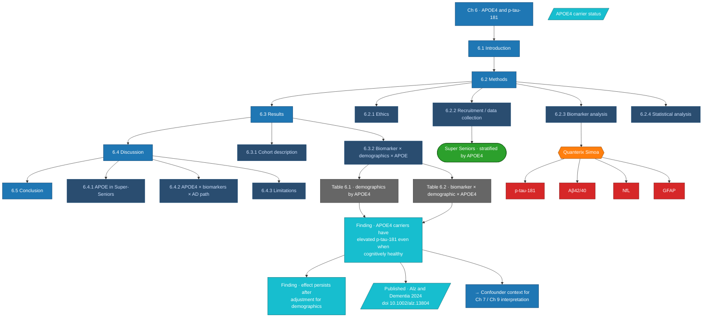

# Chapter 6 — Detailed Map

```mermaid
graph TD
    classDef sec  fill:#1f77b4,stroke:#0b3d69,color:#fff;
    classDef sub  fill:#2a4d70,stroke:#0b3d69,color:#cfe2ff;
    classDef ent  fill:#d62728,stroke:#7a1414,color:#fff;
    classDef coh  fill:#2ca02c,stroke:#0f4f0f,color:#fff;
    classDef meth fill:#ff7f0e,stroke:#8a4304,color:#fff;
    classDef con  fill:#17becf,stroke:#0a6770,color:#fff;
    classDef find fill:#17becf,stroke:#0a6770,color:#fff;
    classDef tab  fill:#666,stroke:#333,color:#fff;

    C6[Ch 6 · APOE4 and p-tau-181]:::sec
    S61[6.1 Introduction]:::sec
    S62[6.2 Methods]:::sec
    S63[6.3 Results]:::sec
    S64[6.4 Discussion]:::sec
    S65[6.5 Conclusion]:::sec
    C6 --> S61 --> S62 --> S63 --> S64 --> S65

    S621[6.2.1 Ethics]:::sub
    S622[6.2.2 Recruitment / data collection]:::sub
    S623[6.2.3 Biomarker analysis]:::sub
    S624[6.2.4 Statistical analysis]:::sub
    S62 --> S621 & S622 & S623 & S624

    S631[6.3.1 Cohort description]:::sub
    S632[6.3.2 Biomarker × demographics × APOE]:::sub
    S63 --> S631 & S632

    S641[6.4.1 APOE in Super-Seniors]:::sub
    S642[6.4.2 APOE4 × biomarkers × AD path]:::sub
    S643[6.4.3 Limitations]:::sub
    S64 --> S641 & S642 & S643

    SS([Super Seniors · stratified by APOE4]):::coh
    SIM{{Quanterix Simoa}}:::meth
    APOE[/APOE4 carrier status/]:::con

    PT[p-tau-181]:::ent
    AB[Aβ42/40]:::ent
    NF[NfL]:::ent
    GF[GFAP]:::ent

    T61[Table 6.1 · demographics by APOE4]:::tab
    T62[Table 6.2 · biomarker × demographic × APOE4]:::tab

    F1[Finding · APOE4 carriers have<br/>elevated p-tau-181 even when<br/>cognitively healthy]:::find
    F2[Finding · effect persists after<br/>adjustment for demographics]:::find

    S622 --> SS
    S623 --> SIM
    SIM --> PT & AB & NF & GF
    S632 --> T61 & T62 --> F1 --> F2

    PUB[/"Published · Alz and Dementia 2024<br/>doi 10.1002/alz.13804"/]:::con
    F1 --> PUB

    NEXT[→ Confounder context for<br/>Ch 7 / Ch 9 interpretation]:::sec
    F1 --> NEXT
```

See also: [[Chapter 06 - APOE4 and p-tau-181]] · [[APOE4]] · [[Super Seniors]]
