# Chapter 7 — Detailed Map

```mermaid
graph TD
    classDef sec  fill:#1f77b4,stroke:#0b3d69,color:#fff;
    classDef sub  fill:#2a4d70,stroke:#0b3d69,color:#cfe2ff;
    classDef ent  fill:#d62728,stroke:#7a1414,color:#fff;
    classDef coh  fill:#2ca02c,stroke:#0f4f0f,color:#fff;
    classDef meth fill:#ff7f0e,stroke:#8a4304,color:#fff;
    classDef path fill:#9467bd,stroke:#4b2c66,color:#fff;
    classDef find fill:#17becf,stroke:#0a6770,color:#fff;
    classDef tab  fill:#666,stroke:#333,color:#fff;

    C7[Ch 7 · Autopsy ADNC]:::sec
    S71[7.1 Introduction]:::sec
    S72[7.2 Methods]:::sec
    S73[7.3 Results]:::sec
    S74[7.4 Discussion]:::sec
    S75[7.5 Conclusions]:::sec
    C7 --> S71 --> S72 --> S73 --> S74 --> S75

    S721[7.2.1 Ethics]:::sub
    S722[7.2.2 Participant / specimen]:::sub
    S723[7.2.3 Autopsy examinations]:::sub
    S724a[7.2.4 Neuropath classifications]:::sub
    S724b[7.2.4 Simoa biomarker analysis]:::sub
    S725[7.2.5 Alamar ARGO biomarker analysis]:::sub
    S726[7.2.6 Statistical analysis]:::sub
    S72 --> S721 & S722 & S723 & S724a & S724b & S725 & S726

    S731[7.3.1 Cohort description]:::sub
    S732[7.3.2 Simoa × AD path grading]:::sub
    S733[7.3.3 Simoa to detect AD pathology]:::sub
    S734[7.3.4 NULISA staging of AD pathology]:::sub
    S73 --> S731 & S732 & S733 & S734

    S741[7.4.1 Grading ADNC with plasma]:::sub
    S742[7.4.2 Detecting significant ADNC]:::sub
    S743a[7.4.3 Cross-platform validation]:::sub
    S743b[7.4.3 Robustness vs complex profiles]:::sub
    S745[7.4.5 Limitations]:::sub
    S74 --> S741 & S742 & S743a & S743b & S745

    %% inputs
    CARD([CARD · autopsy-confirmed]):::coh
    SIM{{Quanterix Simoa · N4PE + p-tau-181 V2}}:::meth
    AL{{Alamar ARGO · NULISA 120-plex}}:::meth

    %% biomarkers — note p-tau-217 added
    AB[Aβ42/40]:::ent
    PT[p-tau-181]:::ent
    PT217[p-tau-217]:::ent
    NF[NfL]:::ent
    GF[GFAP]:::ent

    %% grading systems
    THAL>"Thal phase · Aβ"]:::path
    BRAAK>"Braak stage · NFT"]:::path
    CERAD>"CERAD · neuritic plaques"]:::path
    ABC>"ABC composite · ADNC"]:::path

    %% tables / figures
    T71[Table 7.1 · demographics by ADNC]:::tab
    T72[Table 7.2 · biomarker × grading]:::tab
    F73[Figure 7.3 · binary detection AUROCs]:::tab
    F74[Figure 7.4 · best discriminators]:::tab

    %% findings
    F1["Finding · all 5 biomarkers significantly<br/>associated with all grading measures<br/>linear regression"]:::find
    F2[Finding · NfL not associated with CERAD<br/>p=0.1353]:::find
    F3[Finding · Aβ42/40 strongest with Thal/CERAD<br/>p-tau strongest with Braak]:::find
    F4[Finding · best single discriminator<br/>p-tau-217 AUROC 0.84]:::find
    F5[Finding · combo Aβ42/40 + p-tau-217<br/>AUROC 0.88]:::find
    F6[Finding · 4-marker model AUROC 0.91]:::find

    S722 --> CARD
    S724b --> SIM --> AB & PT & NF & GF
    S725 --> AL --> PT217
    S723 --> THAL & BRAAK & CERAD --> ABC

    S731 --> T71
    S732 --> T72 --> F1 --> F2 --> F3
    S733 --> F73 --> F4 --> F5 --> F6
    S734 --> F74

    NEXT1[→ Ch 8 same cohort,<br/>co-pathology question]:::sec
    NEXT2[→ Ch 9 ADNC-PPS cut-offs]:::sec
    F6 --> NEXT2
    CARD --> NEXT1
```

## Pathology grading systems used

| System | What it grades | Source |
|---|---|---|
| **Thal phase** | anatomical Aβ distribution | Thal et al. |
| **Braak stage** | NFT distribution | Braak & Braak |
| **CERAD** | neocortical neuritic plaque density | CERAD criteria |
| **ABC composite** | combined A (amyloid) + B (Braak) + C (CERAD) → ADNC severity | NIA-AA |

See also: [[Chapter 07 - Autopsy AD Neuropathology]] · [[CARD]] · [[ADNC]] · [[Alamar ARGO]] · [[NULISA]]
