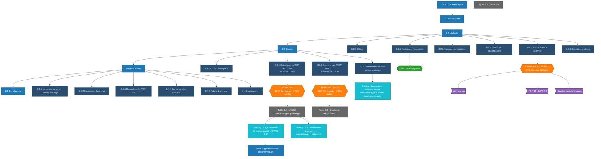

# Chapter 8 — Detailed Map

```mermaid
graph TD
    classDef sec  fill:#1f77b4,stroke:#0b3d69,color:#fff;
    classDef sub  fill:#2a4d70,stroke:#0b3d69,color:#cfe2ff;
    classDef ent  fill:#d62728,stroke:#7a1414,color:#fff;
    classDef coh  fill:#2ca02c,stroke:#0f4f0f,color:#fff;
    classDef meth fill:#ff7f0e,stroke:#8a4304,color:#fff;
    classDef path fill:#9467bd,stroke:#4b2c66,color:#fff;
    classDef find fill:#17becf,stroke:#0a6770,color:#fff;
    classDef tab  fill:#666,stroke:#333,color:#fff;

    C8[Ch 8 · Co-pathologies]:::sec
    S81[8.1 Introduction]:::sec
    S82[8.2 Methods]:::sec
    S83[8.3 Results]:::sec
    S84[8.4 Discussion]:::sec
    S85[8.5 Conclusions]:::sec
    C8 --> S81 --> S82 --> S83 --> S84 --> S85

    S821[8.2.1 Ethics]:::sub
    S822[8.2.2 Participant / specimen]:::sub
    S823[8.2.3 Autopsy examinations]:::sub
    S824[8.2.4 Neuropath classifications]:::sub
    S825[8.2.5 Alamar ARGO analysis]:::sub
    S826[8.2.6 Statistical analysis]:::sub
    S82 --> S821 & S822 & S823 & S824 & S825 & S826

    S831[8.3.1 Cohort description]:::sub
    S832[8.3.2 Detect α-syn / TDP-43 / CVD<br/>full cohort n=84]:::sub
    S833a[8.3.3 Detect α-syn / TDP-43 / CVD<br/>within ADNC n=56]:::sub
    S833b[8.3.3 Common biomarkers across analyses]:::sub
    S83 --> S831 & S832 & S833a & S833b

    S841[8.4.1 Novel biomarkers in mixed-pathology]:::sub
    S842[8.4.2 Biomarkers for α-syn]:::sub
    S843[8.4.3 Biomarkers for TDP-43]:::sub
    S844[8.4.4 Biomarkers for vascular]:::sub
    S845[8.4.5 Future directions]:::sub
    S846[8.4.6 Limitations]:::sub
    S84 --> S841 & S842 & S843 & S844 & S845 & S846

    CARD([CARD · autopsy n=84]):::coh
    AL{{Alamar ARGO · NULISA CNS Disease 120-plex}}:::meth
    LASSO{{LASSO · α=1<br/>1000 CV repeats · ≥75% stability}}:::meth
    EN{{Elastic net · α=0.5<br/>1000 CV repeats · ≥75% stability}}:::meth

    SYN>"α-synuclein"]:::path
    TDP>"TDP-43 / LATE-NC"]:::path
    CVD>"Cerebrovascular disease"]:::path

    T82[Table 8.2 · LASSO biomarkers per pathology]:::tab
    T83[Table 8.3 · Elastic net within ADNC]:::tab
    F82[Figure 8.2 · AUROCs]:::tab

    F1[Finding · α-syn detection<br/>17-marker panel · AUROC 0.95]:::find
    F2[Finding · 3–17 biomarkers retained<br/>per pathology in full cohort]:::find
    F3[Finding · biomarkers common across<br/>analyses suggest shared neurodegen axes]:::find

    S822 --> CARD
    S825 --> AL
    S832 --> LASSO --> T82 --> F1 & F2
    S833a --> EN --> T83
    S833b --> F3

    AL --> SYN & TDP & CVD

    NEXT[→ Plans larger biomarker-discovery study]:::sec
    F1 --> NEXT
```

See also: [[Chapter 08 - Co-pathologies]] · [[LASSO and Elastic Net]] · [[NULISA]] · [[Co-pathologies]] · [[TDP-43 Pathology]]
