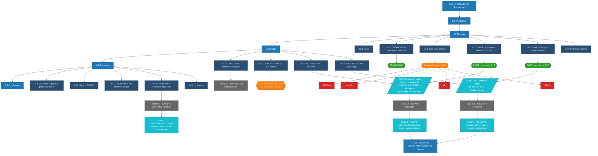

# Chapter 9 — Detailed Map

```mermaid
graph TD
    classDef sec  fill:#1f77b4,stroke:#0b3d69,color:#fff;
    classDef sub  fill:#2a4d70,stroke:#0b3d69,color:#cfe2ff;
    classDef ent  fill:#d62728,stroke:#7a1414,color:#fff;
    classDef coh  fill:#2ca02c,stroke:#0f4f0f,color:#fff;
    classDef meth fill:#ff7f0e,stroke:#8a4304,color:#fff;
    classDef con  fill:#17becf,stroke:#0a6770,color:#fff;
    classDef find fill:#17becf,stroke:#0a6770,color:#fff;
    classDef tab  fill:#666,stroke:#333,color:#fff;

    C9[Ch 9 · COMPASS-ND Prevalence]:::sec
    S91[9.1 Introduction]:::sec
    S92[9.2 Methods]:::sec
    S93[9.3 Results]:::sec
    S94[9.4 Discussion]:::sec
    S95[9.5 Conclusions]:::sec
    C9 --> S91 --> S92 --> S93 --> S94 --> S95

    S921[9.2.1 Ethics]:::sub
    S922[9.2.2 COMPASS-ND participants/samples]:::sub
    S923a[9.2.3 Biomarker analysis]:::sub
    S923b[9.2.3 CHMS · age-specific reference curves]:::sub
    S924[9.2.4 CARD · autopsy-validated cohort]:::sub
    S925[9.2.5 Statistical analysis]:::sub
    S92 --> S921 & S922 & S923a & S923b & S924 & S925

    S931[9.3.1 COMPASS-ND cohort and analysis]:::sub
    S932[9.3.2 COMPASS-ND CSF sub-cohort]:::sub
    S933[9.3.3 RC-PPS in pre-dementia]:::sub
    S934[9.3.4 ADNC-PPS for AD pathology]:::sub
    S93 --> S931 & S932 & S933 & S934

    S941[9.4.1 Creation of plasma probability score]:::sub
    S942[9.4.2 Utility of AD PPS]:::sub
    S943[9.4.3 Prevalence in pre-dementia stages]:::sub
    S944[9.4.4 Prevalence in dementia diagnoses]:::sub
    S945[9.4.5 Limitations]:::sub
    S94 --> S941 & S942 & S943 & S944 & S945

    CND([COMPASS-ND]):::coh
    CHMS([CHMS · norms via Ch 3]):::coh
    CARD([CARD · cut-offs via Ch 7]):::coh
    SIM{{Quanterix Simoa · HD-X}}:::meth
    CSF{{CSF p-tau-181/Aβ42 ratio<br/>cut-off &lt;0.025 / &lt;0.024}}:::meth

    AB[Aβ42/40]:::ent
    PT[p-tau-181]:::ent
    NF[NfL]:::ent
    GF[GFAP]:::ent

    RCPPS[/RC-PPS · pre-dementia<br/>built from age 80–95<br/>5/15/25th & 75/85/95th percentiles<br/>≥80% spec or ≥70% sens/]:::con
    ADNCPPS[/ADNC-PPS · dementia stage<br/>cut-offs via ROC + Youden's index/]:::con

    T91[Table 9.1 · COMPASS-ND demographics]:::tab
    T92[Table 9.2 · RC-PPS sens/spec]:::tab
    T93[Table 9.3 · CARD vs COMPASS-ND demo]:::tab
    T94[Table 9.4 · ADNC-PPS sens/spec]:::tab

    F1[Finding · RC-PPS estimates AD prevalence<br/>in pre-dementia stages]:::find
    F2[Finding · ADNC-PPS estimates AD prevalence<br/>in dementia diagnoses]:::find
    F3[Finding · concordance/discordance<br/>between clinical Dx and PPS profiled]:::find

    S922 --> CND
    S923a --> SIM --> AB & PT & NF & GF
    S923b --> CHMS --> RCPPS
    S924 --> CARD --> ADNCPPS
    S932 --> CSF
    S933 --> RCPPS --> T92 --> F1
    S934 --> ADNCPPS --> T94 --> F2
    S931 --> T91
    S944 --> T93 --> F3

    NEXT[→ Ch 10 synthesis<br/>Clinical Implementation in Canada]:::sec
    F1 --> NEXT
    F2 --> NEXT
```

See also: [[Chapter 09 - COMPASS-ND Prevalence]] · [[Plasma Probability Scores]] · [[COMPASS-ND]] · [[CHMS]] · [[CARD]]
