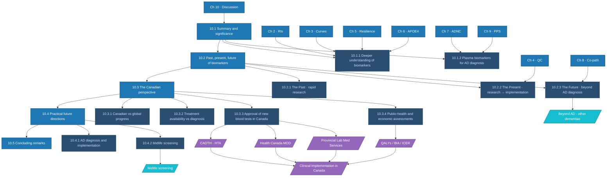

# Chapter 10 — Detailed Map

```mermaid
graph TD
    classDef sec  fill:#1f77b4,stroke:#0b3d69,color:#fff;
    classDef sub  fill:#2a4d70,stroke:#0b3d69,color:#cfe2ff;
    classDef chap fill:#1f77b4,stroke:#0b3d69,color:#fff;
    classDef con  fill:#17becf,stroke:#0a6770,color:#fff;
    classDef cic  fill:#9467bd,stroke:#4b2c66,color:#fff;

    C10[Ch 10 · Discussion]:::sec
    S101[10.1 Summary and significance]:::sec
    S102[10.2 Past, present, future of biomarkers]:::sec
    S103[10.3 The Canadian perspective]:::sec
    S104[10.4 Practical future directions]:::sec
    S105[10.5 Concluding remarks]:::sec
    C10 --> S101 --> S102 --> S103 --> S104 --> S105

    S1011[10.1.1 Deeper understanding of biomarkers]:::sub
    S1012[10.1.2 Plasma biomarkers for AD diagnosis]:::sub
    S101 --> S1011 & S1012

    S1021[10.2.1 The Past · rapid research]:::sub
    S1022[10.2.2 The Present · research → implementation]:::sub
    S1023[10.2.3 The Future · beyond AD diagnosis]:::sub
    S102 --> S1021 & S1022 & S1023

    S1031[10.3.1 Canadian vs global progress]:::sub
    S1032[10.3.2 Treatment availability vs diagnosis]:::sub
    S1033[10.3.3 Approval of new blood tests in Canada]:::sub
    S1034[10.3.4 Public-health and economic assessments]:::sub
    S103 --> S1031 & S1032 & S1033 & S1034

    S1041[10.4.1 AD diagnosis and implementation]:::sub
    S1042[10.4.2 Midlife screening]:::sub
    S104 --> S1041 & S1042

    %% pull-throughs from each data chapter
    C2[Ch 2 · RIs]:::chap
    C3[Ch 3 · Curves]:::chap
    C4[Ch 4 · QC]:::chap
    C5[Ch 5 · Resilience]:::chap
    C6[Ch 6 · APOE4]:::chap
    C7[Ch 7 · ADNC]:::chap
    C8[Ch 8 · Co-path]:::chap
    C9[Ch 9 · PPS]:::chap

    C2 --> S1011
    C3 --> S1011
    C4 --> S1022
    C5 --> S1011
    C6 --> S1011
    C7 --> S1012
    C8 --> S1023
    C9 --> S1012

    %% Canadian-specific concepts
    CADTH[/CADTH · HTA/]:::cic
    MDD[/Health Canada MDD/]:::cic
    PLMS[/Provincial Lab Med Services/]:::cic
    QALY[/QALYs / BIA / ICER/]:::cic
    CIC[/Clinical Implementation in Canada/]:::cic

    S1033 --> CADTH & MDD & PLMS --> CIC
    S1034 --> QALY --> CIC

    %% future directions
    MIDLIFE[/Midlife screening/]:::con
    GLP[/Beyond AD · other dementias/]:::con

    S1042 --> MIDLIFE
    S1023 --> GLP
```

See also: [[Chapter 10 - Discussion]] · [[Clinical Implementation in Canada]] · [[CADTH]] · [[Plasma Probability Scores]]
