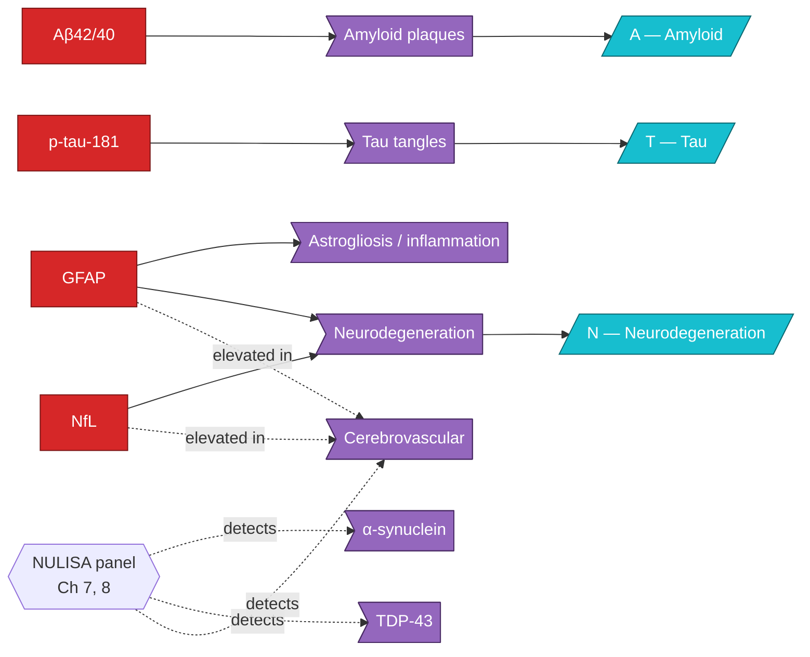

# Map — Biomarkers × Pathology

How the four canonical biomarkers map onto pathology axes.

The four canonical biomarkers cover [[ATN Framework|ATN]] for AD; α-syn, [[TDP-43 Pathology|TDP-43]], and CVD require the multiplex panel — see [[Chapter 08 - Co-pathologies]].
