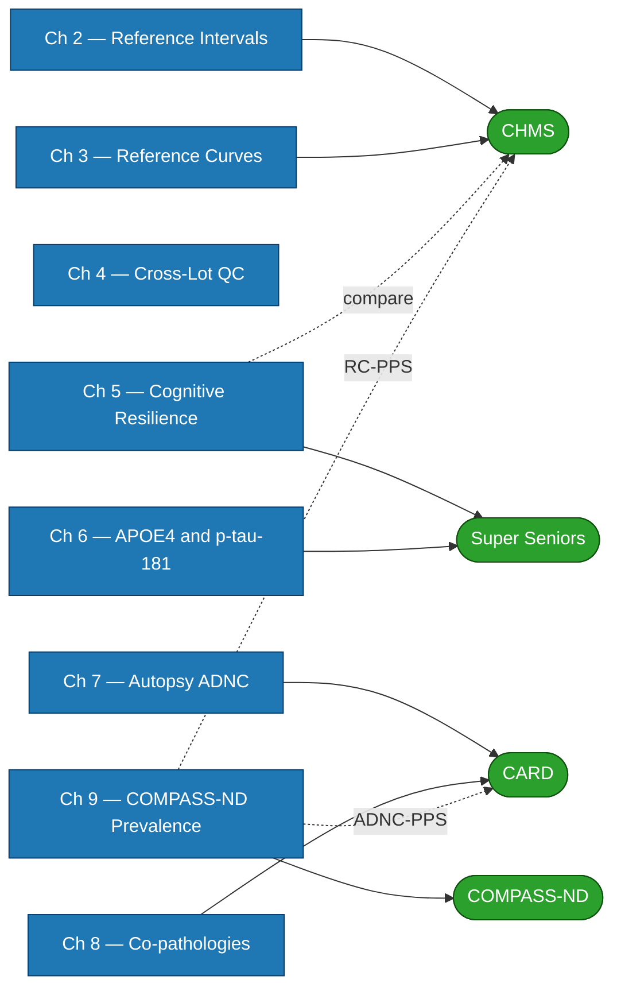

# Map — Chapters × Cohorts

A simpler view: which chapter uses which cohort.

```mermaid
graph LR
    classDef chapter fill:#1f77b4,stroke:#0b3d69,color:#fff;
    classDef cohort  fill:#2ca02c,stroke:#0f4f0f,color:#fff;

    C2[Ch 2 — Reference Intervals]:::chapter
    C3[Ch 3 — Reference Curves]:::chapter
    C4[Ch 4 — Cross-Lot QC]:::chapter
    C5[Ch 5 — Cognitive Resilience]:::chapter
    C6[Ch 6 — APOE4 and p-tau-181]:::chapter
    C7[Ch 7 — Autopsy ADNC]:::chapter
    C8[Ch 8 — Co-pathologies]:::chapter
    C9[Ch 9 — COMPASS-ND Prevalence]:::chapter

    CHMS([CHMS]):::cohort
    SS([Super Seniors]):::cohort
    CARD([CARD]):::cohort
    CND([COMPASS-ND]):::cohort

    C2 --> CHMS
    C3 --> CHMS
    C5 --> SS
    C5 -.compare.-> CHMS
    C6 --> SS
    C7 --> CARD
    C8 --> CARD
    C9 --> CND
    C9 -.RC-PPS.-> CHMS
    C9 -.ADNC-PPS.-> CARD
```
