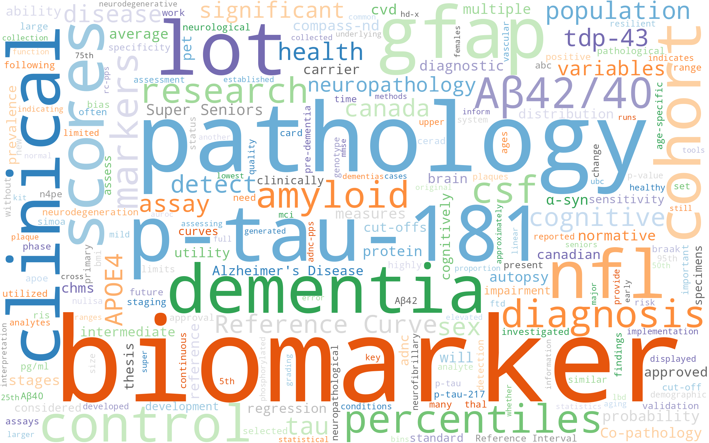

# Word Cloud

Term-frequency cloud built from the body of the thesis (Chapters 1–10). The References section is excluded so journal/citation noise doesn't dominate; an English stopword list plus a thesis-specific stoplist is applied; and a few multi-word concepts (`p-tau-181`, `Aβ42/40`, `Reference Curve`, `Super Seniors`, `Cognitive Resilience`, `Co-pathology`, `Alzheimer's Disease`, `APOE4`) are kept as single tokens.



## What the cloud tells you at a glance

The dominant terms are exactly the thesis's working vocabulary: **biomarker**, **pathology**, **p-tau-181**, **GFAP**, **NfL**, **Aβ42/40**, **APOE4**, **dementia**, **Reference Curve**, **percentiles**, **scores** (as in [[Plasma Probability Scores]]), **autopsy**, **neuropathology**, **cognitive**, **CSF**, **Super Seniors**, **COMPASS-ND**, **Canada**.

The prominence of "lot" reflects the [[Chapter 04 - Cross Lot Analysis|cross-lot QC]] work; "α-syn", "TDP-43", "CVD" reflect [[Chapter 08 - Co-pathologies|the co-pathology chapter]].

## Top 25 terms

See [`word-cloud-words.tsv`](word-cloud-words.tsv) for the full top-200 with counts. The top-25 are:

| rank | count | term |
|---:|---:|---|
| 1  | 774 | biomarker |
| 2  | 450 | pathology |
| 3  | 263 | p-tau-181 |
| 4  | 240 | lot |
| 5  | 218 | GFAP |
| 6  | 217 | clinical |
| 7  | 207 | dementia |
| 8  | 203 | NfL |
| 9  | 193 | scores |
| 10 | 175 | cohort |
| 11 | 146 | control |
| 12 | 140 | Aβ42/40 |
| 13 | 137 | percentiles |
| 14 | 132 | diagnosis |
| 15 | 128 | markers |
| 16 | 127 | CSF |
| 17 | 122 | amyloid |
| 18 | 114 | research |
| 19 | 114 | cognitive |
| 20 | 108 | Reference Curve |
| 21 | 106 | sex |
| 22 | 105 | APOE4 |
| 23 | 105 | tau |
| 24 | 102 | detect |
| 25 | 101 | population |

## How it was made

Generated by [`scripts/build_wordcloud.py`](../../scripts/build_wordcloud.py). Re-run any time:

```bash
pdftotext ubc_2026_may_cooper_jennifer.pdf.pdf /tmp/thesis.txt
python3 scripts/build_wordcloud.py
```

To tweak: edit `EXTRA_STOP` (drop/add stopwords), `MERGE` (merge near-duplicate forms), or `protect` (multi-word concepts that should survive as one token).
